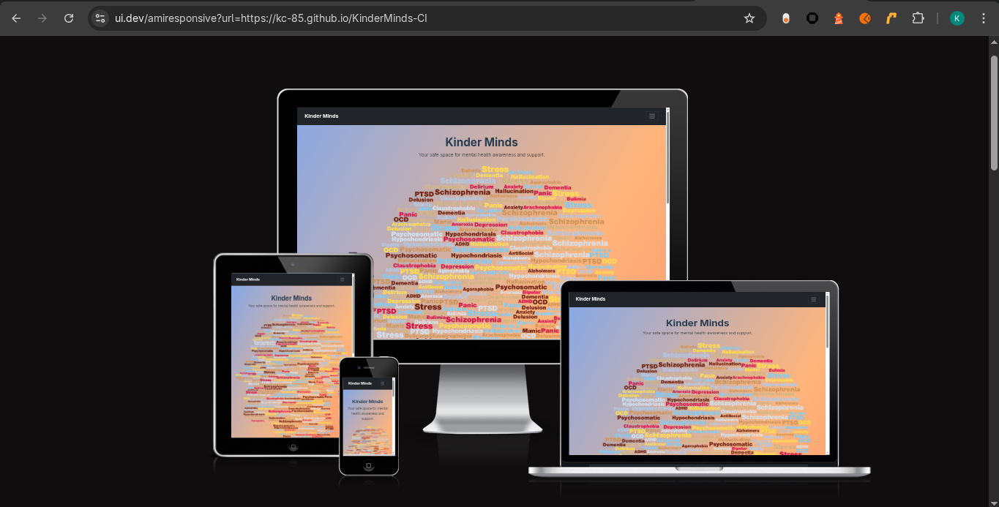
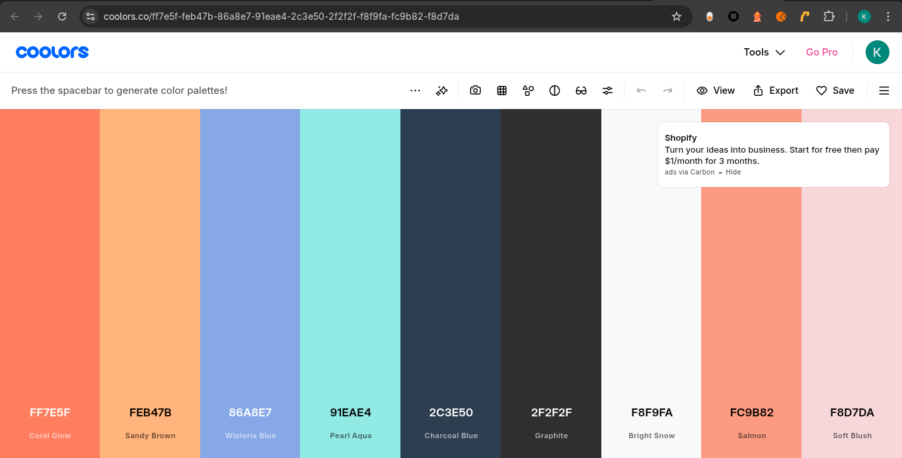
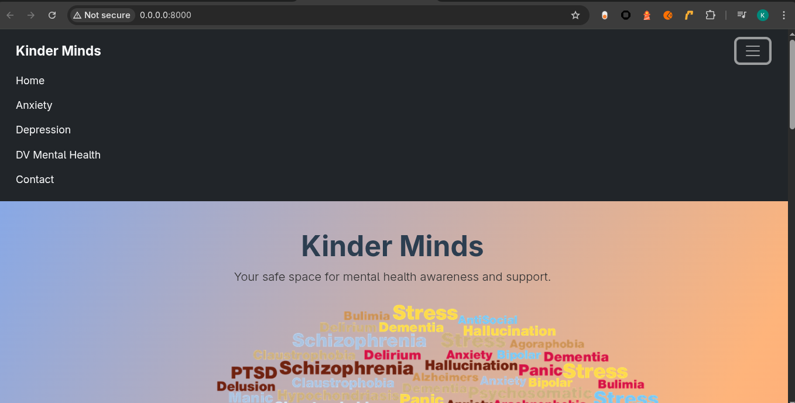
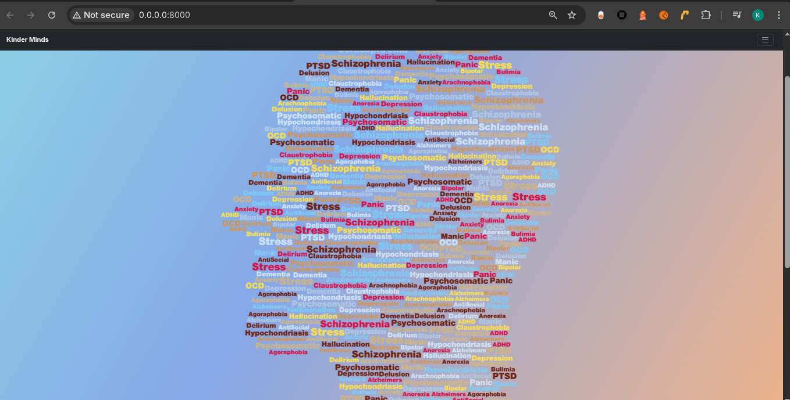
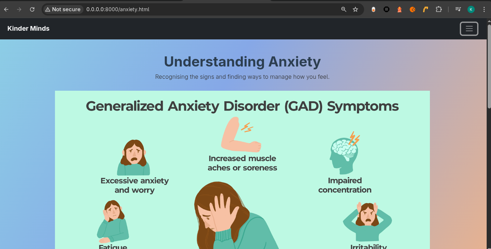
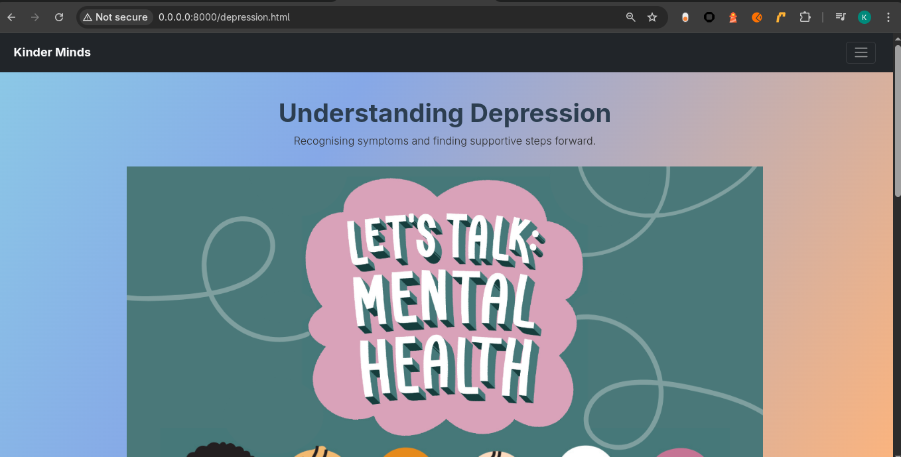
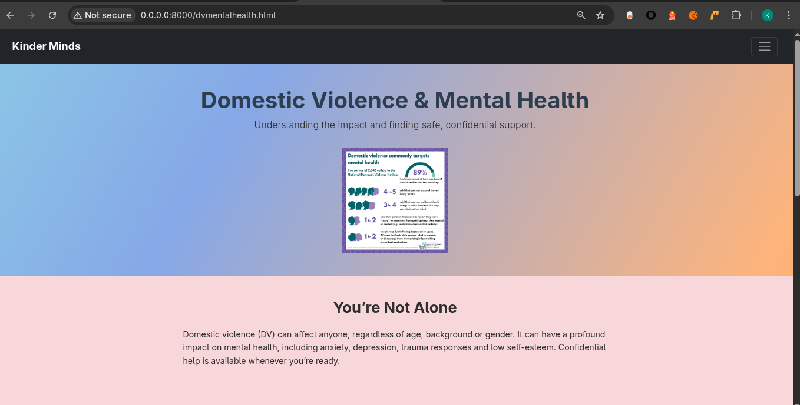
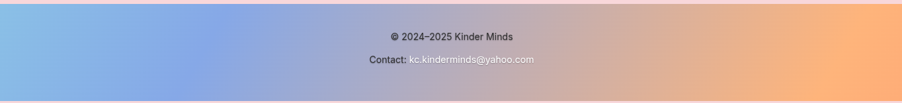
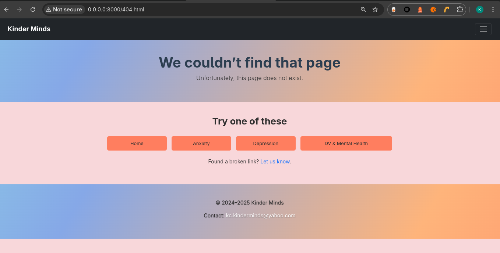

# [KinderMinds-CI](https://kc-85.github.io/KinderMinds-CI)

Developer: Kristian Cross ([KC-85](https://www.github.com/KC-85))

KinderMinds is a simple, supportive, and accessible website designed to raise awareness about mental health topics including Anxiety, Depression, and the impact of Domestic Violence on wellbeing. The goal is to provide clear information, reassurance, and introductory guidance in a calm and approachable environment.

This project was created to address a common issue: many mental health resources online can feel overwhelming, overly clinical, or difficult for new users to navigate. KinderMinds focuses on clarity, readability, and emotional safety by presenting information in a friendly and supportive tone.

I chose this topic because mental health is something that affects nearly everyone—directly or indirectly. Creating a project centred around wellbeing felt meaningful and useful, and allowed me to practise building accessible, user-focused pages with clear navigation, contrast, alt text, and fully responsive layouts. It also gave me the opportunity to integrate knowledge about UX, accessibility standards, and modern front-end design.

KinderMinds is aimed at individuals seeking a gentle introduction to mental health topics, signposting, and reassurance. It is also suitable for anyone who prefers a calm, distraction-free resource when learning about emotional wellbeing.

**Site Mockups**

source: [KinderMinds-CI amiresponsive](https://ui.dev/amiresponsive?url=https://kc-85.github.io/KinderMinds-CI)

> [!IMPORTANT]  
> The examples in these templates are strongly influenced by the Code Institute walkthrough project called "Love Running".

## UX

### The 5 Planes of UX

#### 1. Strategy

**Purpose**
- Provide a calm, easy-to-understand resource for users seeking introductory information on Anxiety, Depression, and DV & Mental Health.
- Reduce overwhelm by presenting short, simple, human-friendly explanations.

**Primary User Needs**Short, supportive explanations of each mental health topic.

Lists of symptoms and self-care ideas.

UK support lines for DV Mental Health.

Simple footer with contact info.
- Understand mental health topics in clear, plain language.
- Navigate between topics easily with accessible navigation.
- Access resources and signposting in a supportive, non-clinical environment.
- Read comfortably on mobile devices.

**Business Goals**
- Deliver a safe, approachable mental health information site.
- Build an accessible, responsive front-end project demonstrating UX, semantic HTML, and modern CSS skills.
- Provide users with reassurance, understanding, and practical next steps.

#### 2. Scope

**[Features](#features)** (see below)

**Content Requirements**

- Clear top navigation (accessible burger menu on all screens).
- Pages for Anxiety, Depression, and DV Mental Health.
- Calm gradient header sections and consistent layout.
- Accessible images with meaningful alt text.
- Skip link, focus visibility, ARIA attributes, and semantic structure.
- Fully responsive design using Bootstrap and custom CSS.
- Custom 404 page for lost users.
- Short, supportive explanations of each mental health topic.
- Lists of symptoms and self-care ideas.
- UK support lines for DV Mental Health.
- Simple footer with contact info.

#### 3. Structure

**Information Architecture**
- **Navigation Menu**:
  - Home
  - Anxiety
  - Depression
  - DV Mental Health
  - Contact (footer)
- **Hierarchy**:
  - Hero section → topic overview → symptoms → self-care → resources
  - Content is kept short and scannable.

**User Flow**
1. User arrives on the homepage and learns what KinderMinds is about.
2. User selects a topic from the consistent burger-menu navigation.
3. User reads clear information sections with supportive language.
4. User can scroll to footer to find contact information.
5. If a user reaches a broken link, they are guided by a custom 404 page.

#### 4. Skeleton

**[Wireframes](#wireframes)** (see below)

#### 5. Surface

**Visual Design Elements**
- **[Colours](#colour-scheme)** (see below)
- **[Typography](#typography)** (see below)

### Colour Scheme

I used [coolors.co](https://coolors.co/ff7e5f-feb47b-86a8e7-91eae4-2c3e50-2f2f2f-f8f9fa-fc9b82-f8d7da) to generate my color palette.

- `#ff7e5f`
- `#feb47b`
- `#86a8e7`
- `#91eae4`
- `#2c3e50`
- `#2f2f2f`
- `#f8f9fa`
- `#fc9b82`
- `#f8d7da`

### Typography

- [Montserrat](https://fonts.google.com/specimen/Montserrat) was used for the primary headers and titles.
- [Lato](https://fonts.google.com/specimen/Lato) was used for all other secondary text.
- [Font Awesome](https://fontawesome.com) icons were used throughout the site, such as the social media icons in the footer.

## Wireframes

To follow best practice, wireframes were developed for mobile, tablet, and desktop sizes.
I've used freehand to design my site wireframes.

| Mobile | Tablet | Desktop | Note |
| --- | --- | --- | --- |
|  |  |  | Each page of Kinder Minds is identical in layout to the Home page |

## User Stories

| Target | Expectation | Outcome |
| --- | --- | --- |
| As a user | I want clear, simple explanations of mental health topics | so I can understand Anxiety, Depression, and DV-related issues without feeling overwhelmed. |
| As a user | I want the navigation to be intuitive and accessible | so I can easily move between topics on any device. |
| As a user | I want the site to feel calm and visually gentle | so I can read sensitive content comfortably. |
| As an user | I want images to have clear alt text | so I understand the context even when using assistive technology. |
| As a user | I want practical, supportive self-care ideas | so I know what small steps I can take. |
| As a user | I would like the website to be fully responsive | so that I can easily navigate and access information from my phone, tablet, or desktop. |
| As a user | I would like to see a 404 error page if I get lost | so that it's obvious that I've stumbled upon a page that doesn't exist. |

## Features

### Existing Features

| Feature | Notes | Screenshot |
| --- | --- | --- |
| Navbar | Featured on all three pages, the full responsive navigation bar includes links to the Logo, Home page, Gallery, and Signup page, and is identical in each page to allow for easy navigation. On the smallest screens, a burger icon is used to toggle the navbar so it doesn't take up too much space. This section will allow the user to easily navigate from page to page across all devices without having to revert back to the previous page via the "back" button. The navbar is also `fixed`, so it stays in view even if the user has scrolled to the bottom of the page. |  |
| Hero Page | The hero page begins with a colourful, calming gradient header, a large title, supportive subtitle, and a relevant image with meaningful alt text. This sets the tone and supports emotional comfort. |  |
| Anxiety | Offers a gentle explanation of anxiety, signs and symptoms, and supportive self-care suggestions. Includes structured bullet lists and icons for readability. |  |
| Depression | Explains what depression is, lists common symptoms, and suggests simple self-care ideas. Content is designed to reduce overwhelm and reassure the reader. |  |
| DV Mental Health | Covers how domestic violence affects mental health. Includes safety tips, self-care ideas, and UK helpline signposting. Uses careful wording to avoid triggering content. |  |
| Footer | Appears on all pages with copyright text and a contact email. Styled using the same gradient colours as the hero to maintain visual consistency. |  |
| 404 | The 404 error page will indicate when a user has somehow navigated to a page that doesn't exist. This replaces the default GitHub Pages 404 page, and ties-in with the look and feel of the *KinderMinds-CI* site by using the standard navbar and footer. |  |

### Future Features

**Simple Mental Health Glossary:**
A non-clinical glossary explaining key emotional wellbeing terms in plain language.

**Resources Directory:**
A curated list of reputable UK mental health organisations and helplines.

**Local Area Signposting:**
Customisable resource lists based on user location.

**Accessibility Themes:**
Options for dyslexia-friendly fonts, dark mode, or reduced-motion mode.

**Downloadable Self-Care Sheets:**
Printable grounding exercises, breathing guides, and support contacts.

**Search Function:**
Simple keyword search to help users find specific topics quickly.

## Tools & Technologies

| Tool / Tech | Use |
| --- | --- |
|  | Generate README and TESTING templates. |
|  | Version control. (`git add`, `git commit`, `git push`) |
|  | Secure online code storage. |
|  | Local IDE for development. |
|  | Main site content and layout. |
|  | Design and layout. |
|  | Hosting the deployed front-end site. |
|  | Front-end CSS framework for modern responsiveness and pre-built components. |
|  | Help debug, troubleshoot, and explain things. |
|  | Troubleshooting and Debugging |

## Testing

> [!NOTE]  
> For all testing, please refer to the [TESTING.md](TESTING.md) file.

## Deployment

### GitHub Pages

The site was deployed to GitHub Pages. The steps to deploy are as follows:

- In the [GitHub repository](https://www.github.com/KC-85/KinderMinds-CI), navigate to the "Settings" tab.
- In Settings, click on the "Pages" link from the menu on the left.
- From the "Build and deployment" section, click the drop-down called "Branch", and select the **main** branch, then click "Save".
- The page will be automatically refreshed with a detailed message display to indicate the successful deployment.
- Allow up to 5 minutes for the site to fully deploy.

The live link can be found on [GitHub Pages](https://kc-85.github.io/KinderMinds-CI).

### Local Development

This project can be cloned or forked in order to make a local copy on your own system.

#### Cloning

You can clone the repository by following these steps:

1. Go to the [GitHub repository](https://www.github.com/KC-85/KinderMinds-CI).
2. Locate and click on the green "Code" button at the very top, above the commits and files.
3. Select whether you prefer to clone using "HTTPS", "SSH", or "GitHub CLI", and click the "copy" button to copy the URL to your clipboard.
4. Open "Git Bash" or "Terminal".
5. Change the current working directory to the location where you want the cloned directory.
6. In your IDE Terminal, type the following command to clone the repository:
	- `git clone https://www.github.com/KC-85/KinderMinds-CI.git`
7. Press "Enter" to create your local clone.

Alternatively, if using Ona (formerly Gitpod), you can click below to create your own workspace using this repository.

**Please Note**: in order to directly open the project in Ona (Gitpod), you should have the browser extension installed. A tutorial on how to do that can be found [here](https://www.gitpod.io/docs/configure/user-settings/browser-extension).

#### Forking

By forking the GitHub Repository, you make a copy of the original repository on our GitHub account to view and/or make changes without affecting the original owner's repository. You can fork this repository by using the following steps:

1. Log in to GitHub and locate the [GitHub Repository](https://www.github.com/KC-85/KinderMinds-CI).
2. At the top of the Repository, just below the "Settings" button on the menu, locate and click the "Fork" Button.
3. Once clicked, you should now have a copy of the original repository in your own GitHub account!

### Local VS Deployment

There are no remaining major differences between the local version when compared to the deployed version online.

## Credits

### Content

| Source | Notes |
| --- | --- |
| [Markdown Builder](https://markdown.2bn.dev) | Help generating Markdown files |
| [Chris Beams](https://chris.beams.io/posts/git-commit) | "How to Write a Git Commit Message" |
| [Love Running](https://codeinstitute.net) | Code Institute walkthrough project inspiration |
| [ChatGPT](https://chatgpt.com) | Help with code logic and explanations |

### Media

- Images
    - [Pexels](https://www.pexels.com)
    - [Unsplash](https://unsplash.com)
    - [Pixabay](https://pixabay.com)
    - [Lorem Picsum](https://picsum.photos) (placeholder images)
    - [Wallhere](https://wallhere.com) (wallpaper / backgrounds)
    - [This Person Does Not Exist](https://thispersondoesnotexist.com) (reload to get a new person)

| Source | Notes |
| --- | --- |
| [favicon.io](https://favicon.io) | Generating the favicon |
| [Love Running](https://codeinstitute.net) | Sample images provided from the walkthrough projects |
| [Font Awesome](https://fontawesome.com) | Icons used throughout the site |
| [Pexels](https://images.pexels.com/photos/416160/pexels-photo-416160.jpeg) | Hero image |
| [Wallhere](https://c.wallhere.com/images/9c/c8/da4b4009f070c8e1dfee43d25f99-2318808.jpg!d) | Background wallpaper |
| [Pixabay](https://cdn.pixabay.com/photo/2017/09/04/16/58/passport-2714675_1280.jpg) | Background wallpaper |
| [DALL-E 3](https://openai.com/index/dall-e-3) | AI generated artwork |
| [TinyPNG](https://tinypng.com) | Compressing images < 5MB |
| [CompressPNG](https://compresspng.com) | Compressing images > 5MB |
| [CloudConvert](https://cloudconvert.com/webp-converter) | Converting images to `.webp` |

### Acknowledgements

- I would like to thank my Code Institute mentor, [Tim Nelson](https://www.github.com/TravelTimN) for the support throughout the development of this project.
- I would like to thank the [Code Institute](https://codeinstitute.net) Tutor Team for their assistance with troubleshooting and debugging some project issues.
- I would like to thank the [Code Institute Slack community](https://code-institute-room.slack.com) and [Code Institute Discord community](https://discord-portal.codeinstitute.net) for the moral support; it kept me going during periods of self doubt and impostor syndrome.
- I would like to thank my friends and family, for believing in me, and allowing me to make this transition into software development.
- I would like to thank my employer, for supporting me in my career development change towards becoming a software developer.
